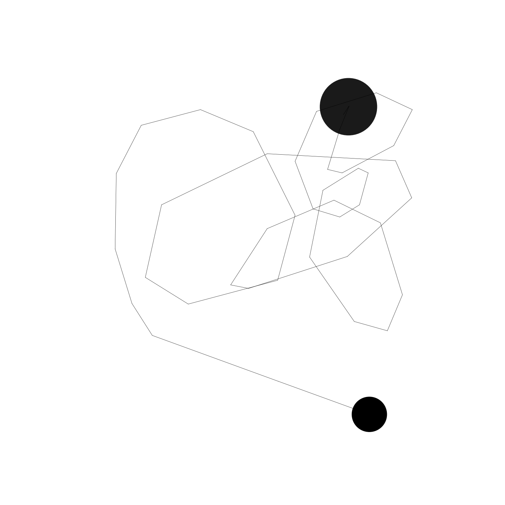

<a name="readme-top"></a>

<!-- PROJECT SHIELDS -->
[![Releases][releases-shield]][releases-url]
[![Releases][pypi-shield]][pypi-url]
[![Python][pypi-pythonversion-shield]][pypi-url] \
[![Contributors][contributors-shield]][contributors-url]
[![Forks][forks-shield]][forks-url]
[![Stargazers][stars-shield]][stars-url]
[![Issues][issues-shield]][issues-url]
[![MIT License][license-shield]][license-url]

<!-- PROJECT LOGO -->
<br />
<div align="center">
  <a href="https://github.com/AndManGames/GameArt">
    
  </a>

<h3 align="center">GameArt</h3>

  <p align="center">
    Create printable art with the movement of your mouse.
    <br />
    <a href="https://github.com/AndManGames/GameArt"><strong>Explore the source code »</strong></a>
    <br />
    <br />
    <a href="https://github.com/AndManGames/GameArt">View Readme</a>
    ·
    <a href="https://github.com/AndManGames/GameArt/issues">Report Bug</a>
    ·
    <a href="https://github.com/AndManGames/GameArt/issues">Request Feature</a>
  </p>
</div>


<!-- TABLE OF CONTENTS -->
<details>
  <summary>Table of Contents</summary>
  <ol>
    <li>
      <a href="#getting-started">Getting Started</a>
      <ul>
        <li><a href="#prerequisites">Prerequisites</a></li>
        <li><a href="#installation">Installation</a></li>
      </ul>
    </li>
    <li><a href="#usage">Usage</a></li>
    <li><a href="#enhancement">Enhancement</a></li>
    <li><a href="#contributing">Contributing</a></li>
    <li><a href="#license">License</a></li>
    <li><a href="#contact">Contact</a></li>
  </ol>
</details>


<!-- GETTING STARTED -->
## Getting Started

GameArt is still work in progress. Currently it is possible to create a png-file with matplotlib from the recorded mouse movement using pynput. The "Art" aspect is currently missing, but I will work on that.

These package versions are available:
* `gameart`: This version is targeting the end user version with the possibility to record your mouse movement, save it as a csv and draw a png based on csv input.
* `gameart[dev]`: This version has additional dev packages to be able to contribute to this project.
* `gameart[release]`: This version has additional build packages to generate a package and upload to PyPi.


### Prerequisites

* Supported python versions: Python 3.10, 3.11, 3.12
* Upgrade pip
  ```sh
  pip install --upgrade pip
  ```
* It is recommended to use the package inside a virtual environment.
    * Create virtual environment
    ```sh
    python -m venv env
    ```
    * Activate virtual environment - Linux
    ```sh
    source env/bin/activate
    ```
    * Activate virtual environment - Windows
    ```sh
    env/Scripts/activate
    ```

### Installation

1. Executable:
    1. Download latest executable from here: https://github.com/AndManGames/GameArt/releases (Windows: `gameart.exe`; Linux: `gameart`)
    **Important**: It could be that your browser and/or Windows defender is flagging the executable as malicious. This comes from pyinstaller and I am working on fixing that. You can be sure that the executables are safe!
2. From GitHub:
    1. Clone the repo
    ```sh
    git clone https://github.com/AndManGames/GameArt.git
    ```
    2. Install gameart packages from git root path
    ```sh
    pip install .
    ```
3. From PyPi:
  ```sh
  pip install gameart
  ```

<p align="right">(<a href="#readme-top">back to top</a>)</p>


<!-- USAGE EXAMPLES -->
## Usage

* If you have downloaded the executable:
    * Double click `gameart` executable file and the GUI will open.
* If you have cloned from github or installed from PyPi:
    * Start GUI from terminal/command line:
        ```sh
        gameart start_gui
        ```
    * Use command line interface (CLI):
        * Start recording of your mouse movement:
        ```sh
        gameart record
        ```
        * Generate image from your mouse recording:
        ```sh
        gameart draw --csv_file_path path/to/csv/file
        ```

* Hint: **Stop the recording** by pressing the `Right Mouse Button`

<p align="right">(<a href="#readme-top">back to top</a>)</p>


<!-- Enhancement requests and Issues -->
## Enhancement

See the [open issues](https://github.com/AndManGames/GameArt/issues) for a full list of proposed features (and known issues).

<p align="right">(<a href="#readme-top">back to top</a>)</p>


<!-- CONTRIBUTING -->
## Contributing

Contributions are what make the open source community such an amazing place to learn, inspire, and create. Any contributions you make are **greatly appreciated**.

If you have a suggestion that would make this better, please fork the repo and create a pull request. You can also simply open an issue.
Don't forget to give the project a star! Thanks again!

For contributing please use the dev setup of this package:
  ```sh
  pip install .[dev]
  ```

<p align="right">(<a href="#readme-top">back to top</a>)</p>


<!-- LICENSE -->
## License

Distributed under the MIT License. See `LICENSE` for more information.

<p align="right">(<a href="#readme-top">back to top</a>)</p>


<!-- CONTACT -->
## Contact

Andreas Schneider - programmerhumor22@gmail.com

Project Link: [https://github.com/AndManGames/GameArt](https://github.com/AndManGames/GameArt)

<p align="right">(<a href="#readme-top">back to top</a>)</p>


<!-- MARKDOWN LINKS & IMAGES -->
<!-- https://www.markdownguide.org/basic-syntax/#reference-style-links -->
[releases-shield]: https://img.shields.io/github/v/release/AndManGames/GameArt?logo=github&style=for-the-badge&label=Latest%20Release
[releases-url]: https://github.com/AndManGames/GameArt/releases
[pypi-shield]: https://img.shields.io/pypi/v/gameart?logo=github&style=for-the-badge
[pypi-pythonversion-shield]: https://img.shields.io/pypi/pyversions/gameart?logo=github&style=for-the-badge
[pypi-url]: https://pypi.org/project/gameart/
[contributors-shield]: https://img.shields.io/github/contributors/AndManGames/GameArt.svg?logo=github
[contributors-url]: https://github.com/AndManGames/GameArt/graphs/contributors
[forks-shield]: https://img.shields.io/github/forks/AndManGames/GameArt.svg?logo=github
[forks-url]: https://github.com/AndManGames/GameArt/network/members
[stars-shield]: https://img.shields.io/github/stars/AndManGames/GameArt.svg?logo=github
[stars-url]: https://github.com/AndManGames/GameArt/stargazers
[issues-shield]: https://img.shields.io/github/issues/AndManGames/GameArt.svg?logo=github
[issues-url]: https://github.com/AndManGames/GameArt/issues
[license-shield]: https://img.shields.io/github/license/AndManGames/GameArt.svg?logo=github
[license-url]: https://github.com/AndManGames/GameArt/blob/master/LICENSE.txt
[product-screenshot]: images/screenshot.png
